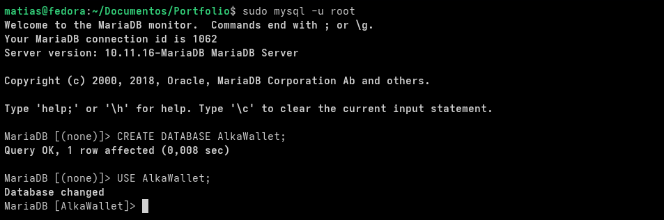
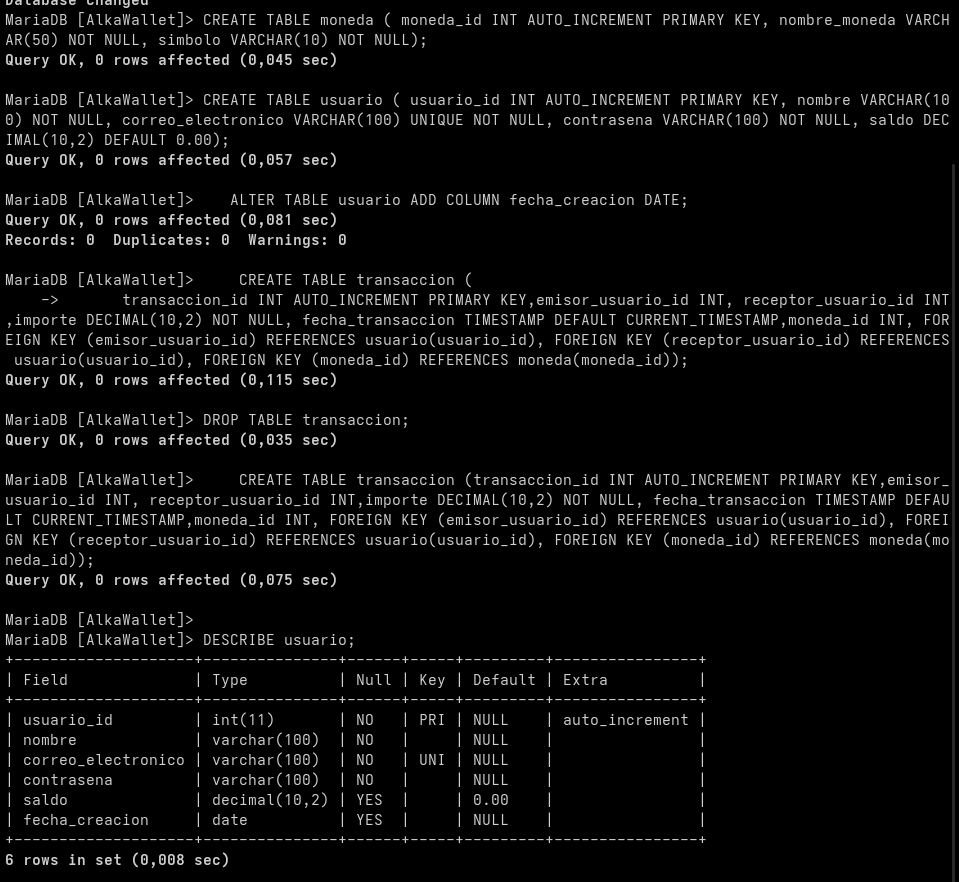
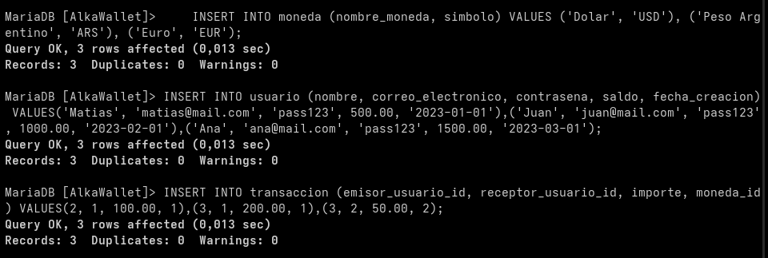
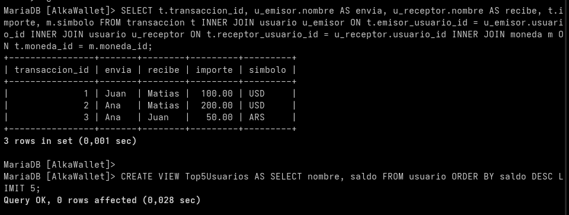
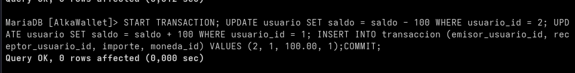
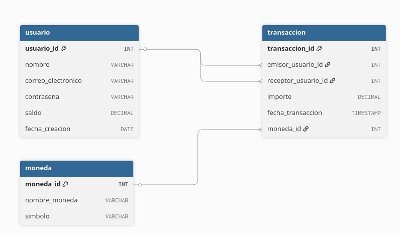

# Proyecto Alka Wallet

Este repositorio contiene el diseño e implementación de la base de datos relacional para el sistema AlkaWallet.  

## 1. Creación de la Base de Datos (DDL)
Se inició el proyecto creando la base de datos `AlkaWallet` en el motor local.

> **Descripción:** Ejecución exitosa de la sentencia `CREATE DATABASE` desde la consola de MariaDB, confirmando el acceso con el usuario root y preparando el entorno del esquema.

---

## 2. Estructura de las Tablas
Se definieron las tablas `moneda`, `usuario` y `transaccion` aplicando claves primarias (PK), claves foráneas (FK) y restricciones de nulidad para asegurar la integridad referencial.

> **Descripción:** Definición DDL de las tablas `moneda`, `usuario` y `transaccion`. Se incluye el resultado de `DESCRIBE usuario;`, evidenciando las claves primarias (PRI), restricciones de nulidad y el campo agregado dinámicamente (`fecha_creacion`).

---

## 3. Población de Datos Iniciales
Para poder operar y realizar consultas, se insertaron registros de prueba en todas las tablas.

> **Descripción:** Ejecución de sentencias DML (`INSERT INTO`) para poblar la base de datos con monedas base (Dólar, Peso, Euro), usuarios de prueba y los primeros registros del historial de transacciones.

---

## 4. Consultas Relacionales y Vistas (DQL)
Para comprender el movimiento de fondos, se ejecutaron diversas consultas, agrupaciones y vistas. La más importante es la vinculación de las tablas para obtener el historial completo.

> **Descripción:** Resultado en consola de un `INNER JOIN` complejo vinculando las 3 tablas para ver quién envió, quién recibió, cuánto y en qué divisa. Además, se incluye la creación exitosa de la vista `Top5Usuarios`.

---

## 5. Transaccionalidad y Propiedades ACID (DML)
Garantizar la consistencia del dinero es crítico en una Wallet. Se implementó una transferencia de fondos controlada mediante una transacción manual.

> **Descripción:** Bloque de ejecución que asegura la propiedad de Atomicidad (A). Incluye un `START TRANSACTION`, actualizaciones de saldo simultáneas (`UPDATE`), registro histórico y el `COMMIT` final para persistir los datos de la transferencia.

---

## 6. Modelo Entidad-Relación (ERD)
La arquitectura general de la base de datos se plasmó en un diagrama conceptual para tener una visión gráfica de las dependencias.

> **Descripción:** Diagrama conceptual que ilustra la arquitectura de la base de datos, evidenciando las relaciones de uno a muchos (1:N) entre la tabla de transacciones, los usuarios involucrados (emisor y receptor) y el tipo de moneda.

---

### Tablas Teóricas Adicionales

#### Comparativa: RDBMS Libres vs Comerciales
| Característica | Libres (ej. MariaDB, PostgreSQL) | Comerciales (ej. Oracle, SQL Server) |
| :--- | :--- | :--- |
| **Costo** | Gratuitos, sin costo de licencia. | Licencias pagas, suelen ser costosas. |
| **Código** | Abierto y auditable por la comunidad. | Propietario y cerrado. |
| **Escalabilidad** | Ideal para todo tamaño con alta flexibilidad. | Orientado a arquitecturas muy restrictivas corporativas. |

#### Correspondencia ER a Modelo Relacional
| Elemento en Diagrama ER | Elemento en Base de Datos Relacional |
| :--- | :--- |
| Entidad (ej. `Usuario`) | Tabla (`usuario`) |
| Atributo (ej. `saldo`) | Columna / Campo |
| Identificador Único | Clave Primaria (Primary Key - PK) |
| Relación | Clave Foránea (Foreign Key - FK) |
